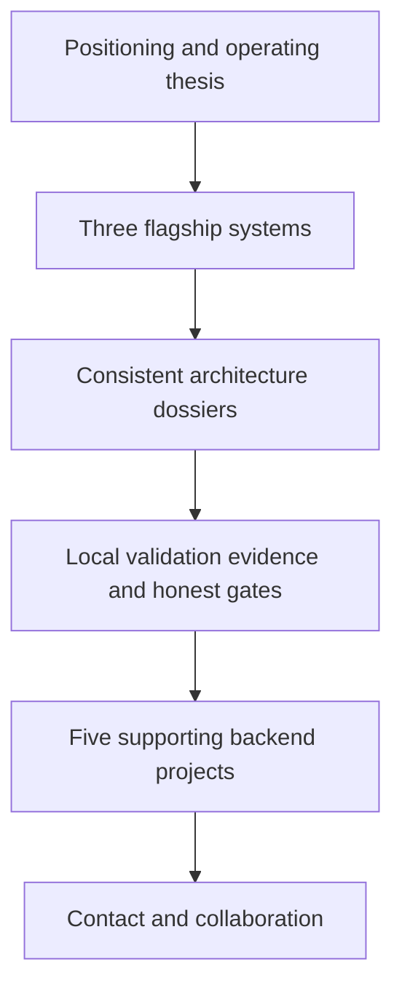

# Portfolio architecture dossier

## Information architecture

The page is a static export. It owns no accounts, persistence, forms, cookies, analytics, or runtime secrets. External navigation is limited to verified HTTPS GitHub destinations.

## Failure and security boundaries

- A production build failure blocks the deploy artifact.
- Internal fragment links are checked against rendered element IDs.
- External repository links are checked separately because network availability is a distinct evidence class.
- The manual-only Pages workflow preserves the explicit deployment approval gate.
- The site contains public project facts and locally generated evidence only; private JobsApply and employer sources stay outside this repository.

## Limitations

The source repositories and flagship links are public. No GitHub Pages deployment, analytics, tagged release, or demo recording exists yet. Responsive and accessibility checks still describe the local build until the deployment gate is approved and exercised.
